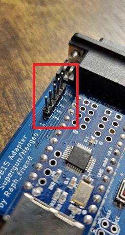
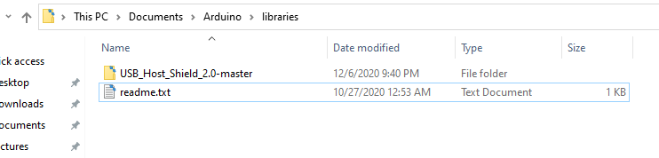
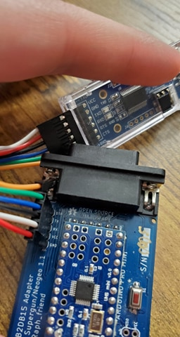
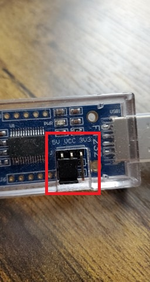
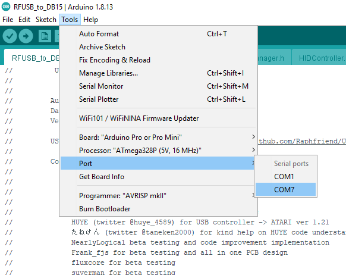
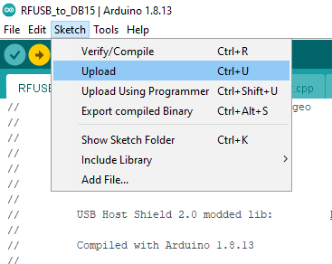

# How to Flash the USB2DB15

## 1. Prerequisites

### Required hardware:
* USB FTDI Programmer
* USB2DB15 with header pins on the FTDI programming interface



### Required software:
* [Arduino IDE](https://www.arduino.cc/en/software)

* This modified USB Host Shield must be placed in your Arduino Libraries Folder.
[Modified USB Host Shield 2.0](https://github.com/Raphfriend/USB_Host_Shield_2.0)



---
## 2. Download the USB2DB15 Project

### Option 1 : Download as ZIP

Download and extract the [USB2DB15 Project](https://github.com/Raphfriend/USB2DB15/archive/refs/heads/master.zip).<br>
Open RFUSB_to_DB15.ino in your Arduino IDE.

### Option 2 : Download as Git repo

Install the [Git Command Line Interface](https://git-scm.com/downloads)

Open your favorite terminal and use git to clone the USB2DB15 project.

```
    git clone https://github.com/Raphfriend/USB_Host_Shield_2.0.git
```

Navigate into the USB2DB15 project and ensure you have the latest changes.

```
    cd .\USB2DB15\
    git fetch -a
    git reset --hard origin/master
```

Open RFUSB_to_DB15.ino in your Arduino IDE.

---
## 3. Connecting the FTDI Programmer

1. Connect the programmer to the USB2DB15 as illustrated. Remember, TX (Transmit) from one device connects to RX (Receive) on the other.

| USB FTDI Programmer      | USB2DB15    |
| ------------------------ | ----------- |
| VCC                      | VCC         |
| GND                      | GND         |
| TXD                      | RX          |
| RXD                      | TX          |
| RTS/DTR                  | DTR         |
| CTS                      | Unused      |



2. If your programmer has a jumper for using 5V or 3.3V, set it to 5V. The USB2DB15 will be powered by the programmer while flashing the software. Plug in the USB programmer.



3. In the Arduino Software, set the flashing mode to 5V as well.


4. Set the appropriate COM Port for your FTDI Programmer. This should be recognized by the Arduino IDE.



5. Upload the software to the USB2DB15 by selecting Sketch->Upload. Do not use <del>Upload Using Programmer</del>



---
## Success!!

Your USB2DB15 should now be updated with the latest software. Feel free to disconnect everything once the upload process has finished and enjoy your games!

---
## FAQ/Troubleshooting

If you run into any issues, please join us on our [Discord Channel](https://discord.gg/XKCjtpH).